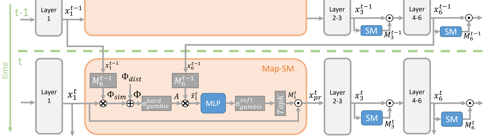

<div align="center"> 
    <h1> Video Patch Pruning: Efficient Video Instance Segmentation via Early Token Reduction </h1>
</div>

<div align="center"> 
<a href="https://arxiv.org/abs/2604.00827">
  
</a>
<a href="https://ecv-workshop.github.io/">
  
</a>
<a href="https://patglan.github.io/Video-Patch_Pruning/">
  
</a>
<a href="https://github.com/PatGlan/Video-Patch-Pruning">
  
</a>
</div>

Official implementation of **"Video Patch Pruning (VPP)"**.

---

## 📝 Why using Video Patch Pruning?

Existing patch pruning methods operate solely on deeper layers. 
Applying them in earlier layers often fails because initial features lack the discriminative detail needed for smart pruning, leading to arbitrary patch removal. 
Consequently, most methods remain computationally "dense" in the early stages of a Vision Transformer (ViT).

Our Video Patch Pruning approch (VPP) solves this by enabling pruning right after the first ViT block.

How does VPP work:
- <b>Mapping Selective Module:</b> We leverage high-quality, foreground-selective features from previous frames.
- <b>Temporal Alignment:</b> These features are temporally aligned to the current frame.
- <b>Instance Identification</b>: VPP avoids "blind spots" by sparsely sampling background tokens, ensuring new objects are detected even in highly sparse feature representations.
- <b>Pruning Strategy:</b> Our Map-SM is fully differentiable and can be applied to any end-to-end pipeline without reliance on classification token. 
- <b>Early Reduction:</b> This cross-frame guidance provides the necessary context to safely prune patches in the very first layers, significantly reducing total computation.

<p align="center">

</p>
<p align="center" style="font-size: 0.9em; color: gray;">
  <b>Figure 1:</b> Mapping-Selective Module. Uses previous frame features to generate temporal pruning masks for early-stage feature reduction.
</p>

---

## 🚀 Getting Started
### 🛠️ Installation
We recommend using Conda to manage your dependencies. This ensures that the specific versions of PyTorch and CUDA required for MMCV are isolated.
```bash
conda create -n vpp python=3.9 -y
conda activate vpp

# Core dependencies
conda install pytorch==1.11.0 torchvision==0.12.0 cudatoolkit=11.3 -c pytorch -y
pip install -r requirements.txt
```

### 📂 Dataset

Download the YouTube-VIS 2019/2021 datasets from [youtube-vos.org](https://youtube-vos.org/dataset/vis/).

Organize the data as follows:

```
data/youtube_vis/
│
├── 📂 annotations/          # .json files
├── 📂 train/                # Training set
│   └── 📂 JPEGImages/       # Video frames (video_id/XXXXX.jpg)
└── 📂 valid/                # Validation set
    └── 📂 JPEGImages/       # Video frames (video_id/XXXXX.jpg)
```

### 📊 Results
The following table summarizes the performance of our models across different YouTube-VIS 2021 versions, comparing dense baselines with various Patch-Pruned configurations.
Checkpoints to the model are available at: [link](https://osf.io/u2x34/files/osfstorage)

| Model Size | **Patch Keep Ratio** | AP_track | mAP_bbox | mAP_segm |                      LogFile                      | Model |
|:-----------|:--------------------:|:--------:|:--------:|:--------:|:-------------------------------------------------:| :---: |
| Small      |     **100% (dense)**     |   50.4   |   57.3   |   52.3   | [link](https://osf.io/vhcqf/?action=download) | [download](https://osf.io/kxfrd/?action=download) |
| Small      |        **51.5%**         |   49.8   |   56.1   |   51.3   |                     [link](https://osf.io/kzy87/?action=download)                     | [download](https://osf.io/m8kjw/?action=download) |
| Small      |        **39.3%**         |   48.5   |   54.3   |   49.9   |                     [link](https://osf.io/2kxcg/?action=download)                     | [download](https://osf.io/yxjk6/?action=download) |
| tiny       |     **100% (dense)**     |   42.2   |   49.1   |   44.8   |                     [link](https://osf.io/75ucm/?action=download)                     | [download](https://osf.io/pq9jd/?action=download) |
| tiny       |        **52.7%**         |   42.3   |   49.9   |   45.7   |                     [link](https://osf.io/v7jdc/?action=download)                     | [download](https://osf.io/e6fa9/?action=download) |
| tiny       |        **40.9%**         |   40.9   |   47.6   |   43.6   |                     [link](https://osf.io/tg5ap/?action=download)                     | [download](https://osf.io/bwhge/?action=download) |


### 🧪 Evaluation
To evaluate the SViT-Adapter Small at 40% Patch Keep Ratio (PKR) on Youtube-Vis 2021, use:
```bash
python tools/test.py configs/vis/vpp/vpp_vitTiny_4xb2_6e_0.4PKR_ytvis21.py --checkpoint checkpoints/vpp_vitAda_rovis_ytvis21/small/PKR=0.4/epoch_6.pth
```

### 🏋️ Training

<b>Dense Training</b> 

The model is first trained in a "dense" (non-pruned) setting. We use a ViT-Adapter backbone pretrained on COCO 2017 and train for 6 epochs.

```bash
# Single GPU
python tools/train.py configs/vis/rovis/rovis_mask2former_vitAdaSmall_ytvis21.py

# Multi-GPU (Distributed)
bash tools/dist_train.sh configs/vis/rovis/rovis_mask2former_vitAdaSmall_ytvis21.py 8
```

<b>Sparse FineTuning</b>

For sparse fine-tuning, we utilize the same training schedule as the dense stage but enable Video Patch Pruning (VPP) to reduce spatial redundancy.

```bash
# Distributed Fine-tuning# Distributed Fine-tuning
bash tools/dist_train.sh configs/vis/vpp/vpp_vitSmall_4xb2_6e_0.4PKR_ytvis21.py 8
```

Note: Checkpoints for the Mask2Former models pretrained on COCO 2017 are available here: [ViT-Adapter Tiny](https://osf.io/rywjc/?action=download) and [ViT-Adapter Small](https://osf.io/k5ymu/?action=download).


---

## 📜 Citation
If you use this code in your research, please cite the following paper:
```
@inproceedings{
  glandorf2026vpp,
  title={Video Patch Pruning: Efficient Video Instance Segmentation via Early Token Reduction},
  author={Patrick Glandorf and Thomas Norrenbrock and Bodo Rosenhahn},
  booktitle={Conference on Computer Vision and Pattern Recognition Workshop},
  year={2026}
}
```