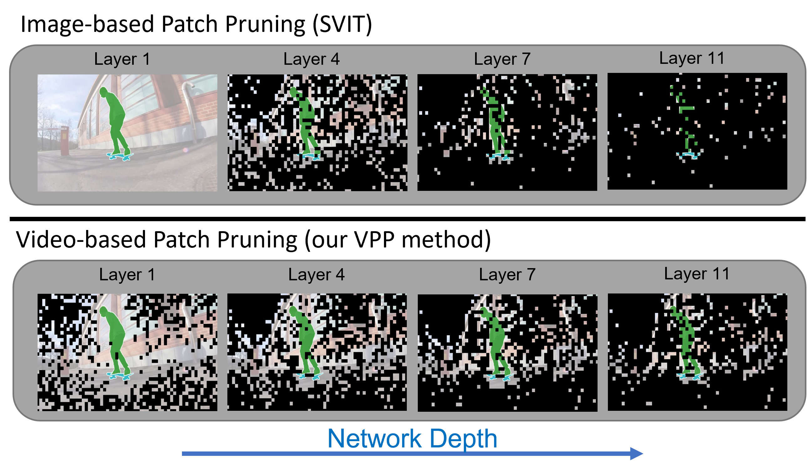
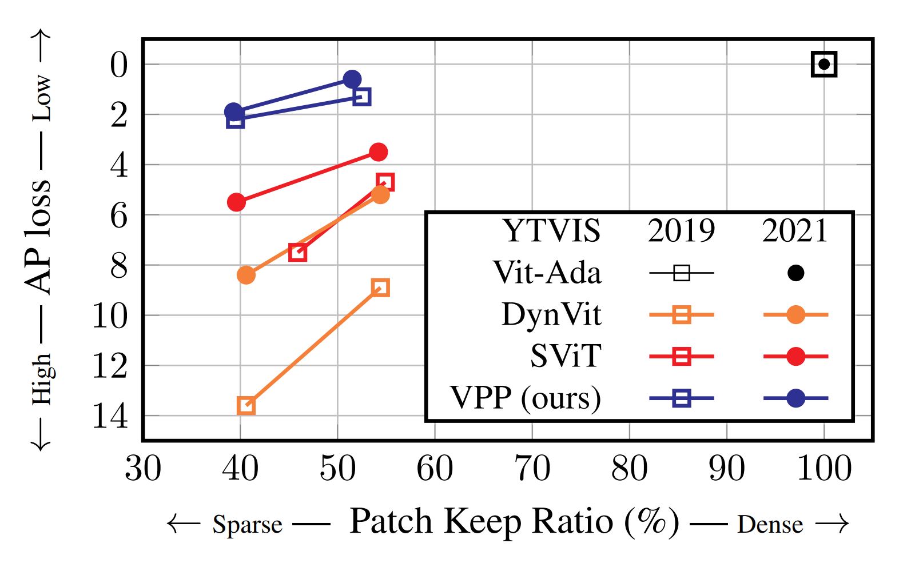

<div align="center"> 
    <h1> Video Patch Pruning: Efficient Video Instance Segmentation via Early Token Reduction </h1>
</div>

<div align="center"> 
<a href="https://arxiv.org/abs/2604.00827">
  
</a>
<a href="https://ecv-workshop.github.io/">
  
</a>
<a href="https://patglan.github.io/Video-Patch_Pruning/">
  
</a>
<a href="https://github.com/PatGlan/Video-Patch-Pruning">
  
</a>
</div>

---


<p style="font-style: italic; background-color: #f0f0f0; padding: 10px; display: inline-block; text-align: justify;">
Vision Transformers (ViTs) have demonstrated state-ofthe-art performance in several benchmarks, yet their high computational costs hinders their practical deployment. 
Patch Pruning offers significant savings, but existing approaches restrict token reduction to deeper layers, leaving early-stage compression unexplored. 
This limits their potential for holistic efficiency. 
In this work, we present a novel Video Patch Pruning framework (VPP) that integrates temporal prior knowledge to enable efficient sparsity within early ViT layers. 
Our approach is motivated by the observation that prior features extracted from deeper layers exhibit strong foreground selectivity. 
Therefore we propose a fully differentiable module for temporal mapping to accurately select the most relevant patches in early network stages. 
Notably, the proposed method enables a patch reduction of up to 60% in dense prediction tasks, exceeding the capabilities of conventional image-based patch pruning, which typically operate around a 30% patch sparsity. 
<!-- VPP excels the high-sparsity regime, sustaining remarkable performance even when patch usage is reduced below 55%. Specifically, it preserves stable results with a maximal performance drop of 0.6% on the Youtube-VIS 2021 dataset. -->
</p>

This [GitHub](https://github.com/PatGlan/Video-Patch-Pruning) repository contains the code for our paper: [**Video Patch Pruning: Efficient Video Instance Segmentation via Early Token Reduction**](https://arxiv.org/abs/2604.00827)

---

<div align="center"> 
    <h2> Motivation </h2>
</div>

Traditional image-based token pruning methods operate on each frame independently, creating a structural bottleneck: relevant foreground objects cannot be reliably identified in the initial layers where features lack semantic depth. 
Consequently, methods like SVIT require these early, computationally expensive layers to remain entirely dense (as seen in the top row of the figure), limiting the potential for holistic efficiency.


Our Video Patch Pruning (VPP) framework overcomes this limitation by leveraging temporal context. 
By mapping high-level priors from preceding frames onto the current input, VPP identifies relevant foreground patches starting at the very first layer. 
This cross-frame awareness enables aggressive early-stage pruning that static models cannot achieve, resulting in significant computational savings while maintaining high dense-prediction accuracy.


<!-- 
Traditional Token Pruning methods work image based, where each image must be pruned independently. 
A very crutial problem of these methods, is that the relevant patches, like the foreground objects related patches cannot be identified within the first layers.
Following all image-based methods requrie the first layers to be dense, mitigating the potential for holiistic efficienty throughout all layers.

Our Video Patch Pruning (VPP) framework addresses this issue, by utilizing the video-temporal context to prune less relevant patches in the very first layers. 
This is done by mapping high-level priors from previous frames onto the current input, in order to identity relevant foregorund patches.
This approach enables highly efficient models using early-stage pruning that static image-based models cannot achieve, resulting in significant computational savings without sacrificing dense prediction accuracy.
-->

<p align="center">

</p>
<p align="center" style="font-size: 0.9em; color: gray;">
  <b>Figure 1:</b> Pruning Visualization. Comparison of removed tokens (black) between image-based (SVIT) and Video Patch Pruning (VPP) across model layers.
</p>

---

<div align="center"> 
    <h2> Method </h2>
</div>


We introduce the Mapping-Selective Module (Map-SM), a lightweight pruning module for early patch reduction within the initial Vit layers.
Figure 2 shows the corresponding block diagram.
Map-SM leverages highly discriminative foreground features from the previous frame and projects them onto the current frame based on feature similarities.
The transformation is governed by an Association Matrix ($A$), which encodes the spatial relationships required to map sparse historical features onto the current input. 
Crucially, this mechanism is parameter-free, allowing for efficient temporal alignment without increasing model capacity. 

Note: Map-SM is universally applicable to spatio-temporal data, as its pruning mechanism is independent of classification token dependencies.


<p align="center">

</p>
<p align="center" style="font-size: 0.9em; color: gray;">
  <b>Figure 2:</b> Mapping-Selective Module. Uses previous frame features to generate temporal pruning masks for early-stage feature reduction.
</p>

As demonstrated in Figure 3, VPP maintains robust performance in high-sparsity regimes where traditional image-based methods experience significant accuracy degradation.

<p align="center">

</p>
<p align="center" style="font-size: 0.9em; color: gray;">
  <b>Figure 2:</b> Video Instance Segmentation Performance. mAP vs. efficiency trade-offs on YouTube-VIS 2019 and 2021 benchmarks.
</p>

<br>

---

## Citation


If you use this code in your research, please cite the following paper:

```
@inproceedings{
  glandorf2026vpp,
  title={Video Patch Pruning: Efficient Video Instance Segmentation via Early Token Reduction},
  author={Patrick Glandorf and Thomas Norrenbrock and Bodo Rosenhahn},
  booktitle={Conference on Computer Vision and Pattern Recognition Workshop},
  year={2026}
}
```
